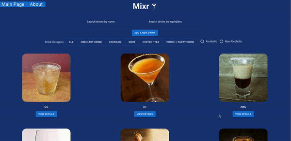

# Welcome to Mixr!
[Mixr](https://mixr-app.netlify.app/) is an app that lets you search for drink recipes(or add your own), from a crowdsourced list of over 600 cocktails and mixed drinks.\
It was bootstrapped using [Create React App](https://create-react-app.dev/). The data set utilized was acquired from [The Cocktail DB](https://www.thecocktaildb.com/)

## Technologies
- React 18.2
- React Router v5
- Material UI
- Heroku
- Netlify

## Usage
Search for drinks by name

### or

Search for drinks by ingredient

## Credits
- [The Cocktail DB](https://www.thecocktaildb.com/) for the API
- [Samuel Banya](https://github.com/samuelbanya) for the cool app name